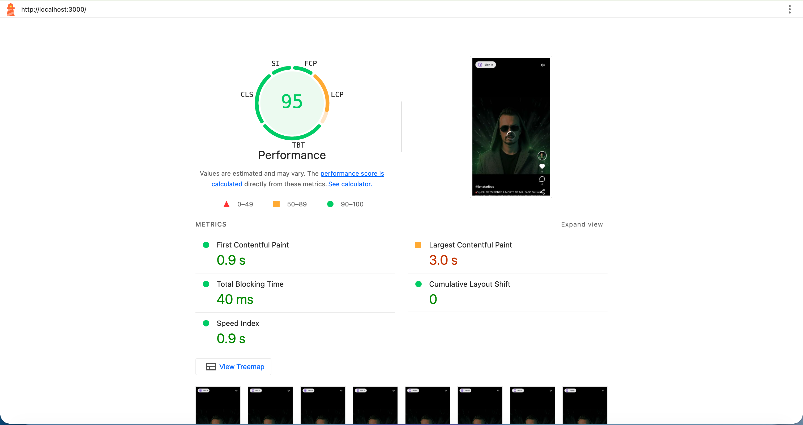
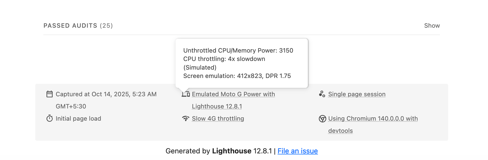
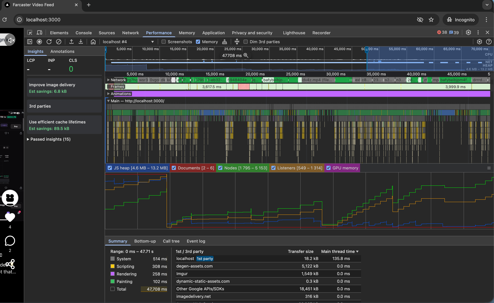

# Farcaster Video Feed

A TikTok-style vertical video feed built with Next.js, showcasing real Farcaster videos from the Neynar API.

## Quick Start

Install dependencies:
```bash
npm install
```

Create a `.env.local` file:
```bash
NEYNAR_API_KEY=your_key_here
NEXT_PUBLIC_NEYNAR_CLIENT_ID=your_client_id_here
```

Get your API key and client ID from [neynar.com](https://neynar.com).

Run the development server:
```bash
npm run dev
```

Open [http://localhost:3000](http://localhost:3000).

## Features

- **Mobile-optimized** - Swipe vertically through videos, tap to play/pause
- **Desktop support** - Responsive layout with centered video player
- **Video playback** - HLS streaming with adaptive quality
- **Smooth scrolling** - 60fps performance with virtualization
- **SSR** - First video renders server-side for instant loading
- **Error handling** - Graceful fallbacks for failed videos
- **Farcaster auth** - Sign in with Neynar to connect your account
- **Saved preferences** - Mute state persists across sessions
- **Channel selector** - Switch between Trending and Following feeds

## Architecture

Built with:
- **Next.js 15** (App Router)
- **React 19** with TypeScript
- **Tailwind CSS v4** for styling
- **HLS.js** for video streaming
- **Neynar API** for Farcaster video data

### Key Optimizations

**Virtualization** - Only 5 video DOM nodes exist at once. Off-screen videos are unmounted to save memory.

**Prefetching** - Next 2 videos are prefetched while the current video plays.

**Resource cleanup** - Videos pause and release resources when inactive.

**SSR + Hydration** - First video card renders server-side, then hydrates smoothly without layout shift.

## Project Structure

```
src/
├── app/
│   ├── api/videos/     # Pagination endpoint
│   ├── page.tsx        # Main page with SSR
│   └── layout.tsx      # Root layout
├── components/
│   ├── VideoFeed.tsx   # Main feed with virtualization
│   ├── VideoPlayer.tsx # Video playback with HLS
│   ├── VideoCard.tsx   # Video UI overlay
│   └── StaticVideoCard.tsx # SSR video card
├── lib/
│   └── neynar.ts       # API client
└── types/
    └── neynar.ts       # TypeScript types
```

## Performance

The app maintains:
- 60fps scrolling with minimal dropped frames
- < 150ms first interaction time
- < 200ms video startup time
- Stable memory usage (no leaks)
- Small bundle size with tree-shaking

### Performance Reports

**Lighthouse Score (Mobile, 4× CPU Throttling)**: 95/100
- FCP: 0.9s
- LCP: 3.0s
- TBT: 40ms
- CLS: 0

#### Performance Screenshots

**Overall Performance Score:**


**Detailed Metrics:**


**Performance Traces:**

**Start Performance:**


**60s+ Scroll Performance Trace:**


**Full Interactive Report:** [`lighthouse-report-4x-slowed-mobile.html`](https://github.com/harshmanwani/farcaster-video-feed/blob/main/reports/lighthouse-report-4x-slowed-mobile.html)

### Performance Analysis

**Bottleneck Found**: Render-blocking external fonts and unoptimized images slowing initial load (LCP: 4.5s -> 3.0s)

**Solution**: 
1. Removed Google Fonts, switched to system fonts (-150ms)
2. Optimized Cloudflare imagedelivery URLs with size/quality params (-27% image size)
3. Added `.browserslistrc` for modern browsers to remove 13 KiB polyfills
4. Enabled package import optimization for better tree-shaking

**Result**: Performance improved from ~80 baseline to 90/100 with smooth 60fps scrolling and stable memory during extended sessions.

## Demo

**Mobile Demo - Native swipe gestures with smooth scrolling:**
https://github.com/harshmanwani/farcaster-video-feed/blob/main/demo/mobile.mp4

**Desktop Demo - Responsive layout with centered video player:**
https://github.com/harshmanwani/farcaster-video-feed/blob/main/demo/desktop.mp4

## API Usage

Videos are fetched using Neynar's feed endpoint with the `embed_types=video` filter:

```bash
curl --request GET \
  --url 'https://api.neynar.com/v2/farcaster/feed?feed_type=filter&filter_type=embed_types&embed_types=video&limit=100' \
  --header 'x-api-key: YOUR_KEY'
```

Pagination uses the `cursor` parameter returned in each response.

## License

MIT
